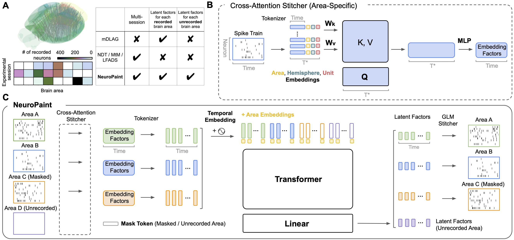

# NeuroPaint
NeuroPaint is an autoencoder for inpainting neural dynamics in the unrecorded brain areas by stitching multi-session multi-area Ephys neural data.



### Installation

```bash
conda env create -f env.yaml    # Create conda environment

conda activate neuropaint       # Activate conda environment
```
If you want to train and test the model on IBL dataset:
```bash
pip install -r ibl_requirements.txt 
```

### Data Preparation
For **synthetic dataset**, you need to change the paths in `src\loader\chaotic_rnn_loader.py` and run
```bash
python src\loader\chaotic_rnn_loader.py
```

For **IBL dataset**, you need to change the path in `src\loader\data_loader_ibl.py` and run
```bash
python src\loader\data_loader_ibl.py
```

For **MAP dataset**, you need to change the path in `src\loader\data_loader_ibl.py` and `src\utils\svoboda_data_utils.py`. In addition, to you need to download the MAP dataset in the `data\` folder from DANDI Arxiv:
```bash
#first navigate to the folder data\
dandi download DANDI:000363/0.230822.0128
```

P.S. If you don't know what know what dandi is or don't have DANDI CLI, you need to first install it:
```bash
pip install "dandi>=0.60.0"
```

Then run
```bash
python src\loader\data_loader_unbalanced_lump_short_list.py
```


### Training
To train NeuroPaint on synthetic/IBL/MAP dataset using multiple GPUs, you need to update folder paths in `scripts/train_neuropaint_on_XX_data.sh`, `src/train_on_XX.py`, `src/loader/XX.py`, and then run:

```bash
sbatch scripts/train_neuropaint_on_XX_data.sh
```

### Test
To calculate NeuroPaint's performance on the test set of synthetic/IBL/MAP dataset, update the folder paths in `scripts/test_neuropaint_on_XX_data.sh`, `src/test_perf_XX.py`, and then run:

```bash
sbatch scripts/test_neuropaint_on_XX_data.sh
```

### Results Reproduction
The included jupyter notebooks reproduce all main results from the paper and several supplementary results, with outputs saved for inspection. These notebooks are intended as read-only references so you can see the exact analysis/plotting steps used in the paper. 

At this time, the notebooks are not directly runnable because they depend on trained model checkpoints, dataset files and preprocessing products that are not publicly hosted yet. 


### NeuroPaint-Linear
In the paper’s appendix, we introduce a **linear** variant of NeuroPaint called **NeuroPaint-Linear**. This model is closely related to a reduced-rank regression (RRR) formulation, and in some notebook comments or figure captions it is referred to as **“RRR”** for brevity. For code and instructions specific to the linear model, please see the companion repository: https://github.com/realwsq/NeuroPaint-Linear

